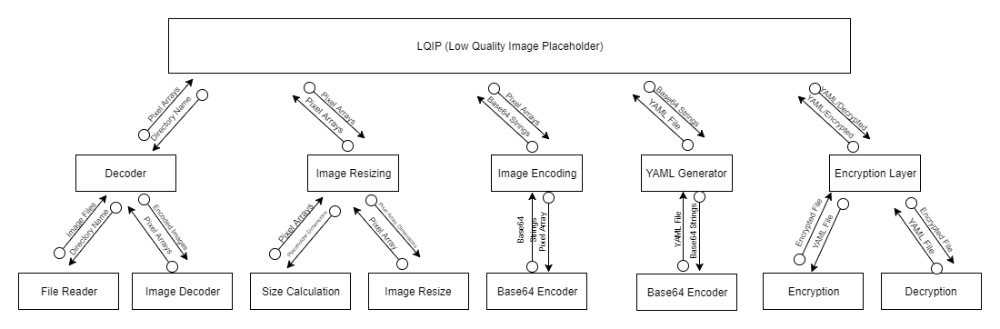

# LQIP
## Low Quality Image Placeholders

LQIP is a program which website administrators can use to generate low quality placeholder version of image resources thier website uses. These are for when a user wants to view one of thier webpages, but has a slow connection, and so the placeholder will take the place of the full size image until it has been fully downloaded by thier browser.

## Scope / Features
LQIP is designed to work with a directory of image resources in certain common formats. It works from the command line, and is designed to be used by administrators in scripts or cron jobs to automatically generate the images.

 * Works on a directory of image files
 * Produces a YAML file as output for administrators to include in thier scripts
 * Features an excrpytion layer, allowing for generating images on a seperate computer, and then sending the file to the appropriate server, where it can be decrypted. 

## Structure

The below diagram shows the 5 main modules of the LQIP program. 

The decoder module searches a directory for images and decodes them into pixel arrays. The resize module creates new images based on the provided width. The encoder module prepares the images for being stored in YAML format. The YAML generator takes the Base64 encoded images and stores them in a YAML file. And finally, the encryption module encrypts and decrypts the YAML files for secure transport. 
